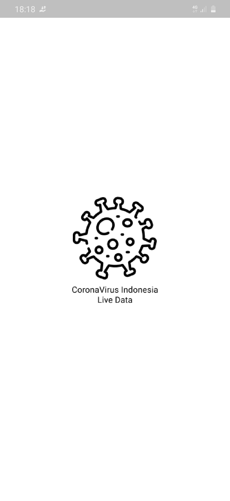
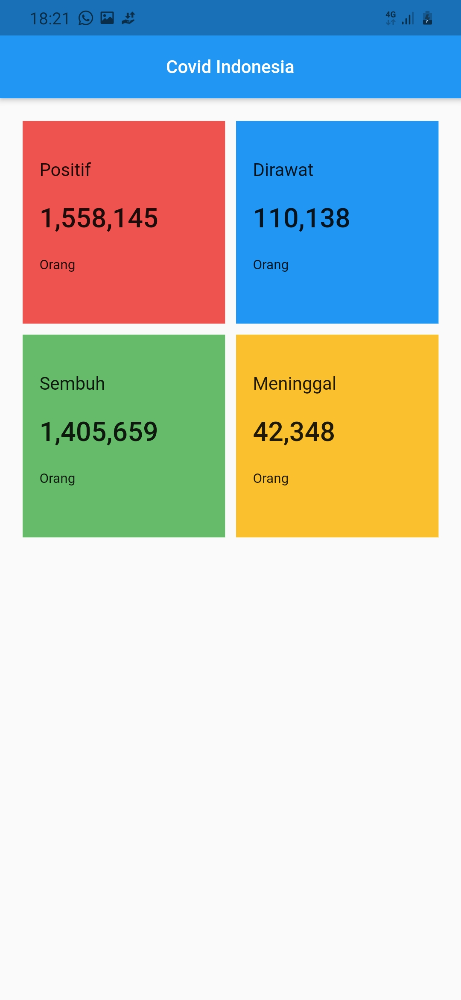

# Aplikasi Mobile Dashboard Covid 19
Project UTS Framework MObile <b>STMIK Akakom Yogyakart</b>
### Dibuat Dengan Menggunakan :
- Flutter Version : `Flutter 2.0.3 • channel stable`
- VS Code
- Aplikasi dapat di coba dalam folder `build_apk/app-debug.apk`
- Dependencies Tambahan :
    - <b>Dio</b> Untuk Klien HTTP untuk get data dari API selengkapnya https://pub.dev/packages/dio
    - Assets Image ON
    - <b>change_app_package_name</b> saya gunakan Untuk mengganti package name selengkapnya https://pub.dev/packages/change_app_package_name
- Kumpulan Package https://pub.dev/
# API SPEC
- GET Data Indonesia :
    - Method : GET
    - Endpoint : `https://api.kawalcorona.com/indonesia`
    - Response :
        ```json
        [
            {
                "name" : "String",
                "positif" : "String",
                "sembuh" : "String",
                "meninggal" : "Stringr",
                "dirawat" : "String"
            }
        ]
        ```
        Dalam bentuk array List Json,
        - Keterangan :
            - Gunakan Postman untuk uji coba REST API request ke `https://api.kawalcorona.com/indonesia` 
            - Hasil respons saya copy kemudian open link https://javiercbk.github.io/json_to_dart/ untuk mengconver json ke dart yang kemudian saya simpan dengan nama file ```kasus_indonesia.dart```
            - Masih ada cara lain untuk melakukan get data selain menggunakan dio ada http retrofit dan lain sebagainya namun saya menggunakan <b>DIO</b> Karna belum pernah mencobanya.
# UI
Tampilan masih dalam proses develop belum selesai semua, intinya aplikasinya akan mirip dengan aplikasi yang saya buat sebelumnya dengan mengguanakn <b>bahasa pemrograman Kotlin</b> link aplikasi yang serupa https://github.com/04burhanuddin/Mobile-Dashboard-Coronavirus-LiveData Pada aplikasi ini saya buat dengan  menggunakan Framework Flutter dengan meniru tampilan aplikasi sebelumnya, dan masih dalam proses pengembangan.
- SplashScreen dan Dashboard
    
    <!--   -->
    - SplashScreen, Menggunakan Image assets
    - HomeScreen, Menggunakan GridView untuk menampilkan data

# Project Structure
```
📦lib
 ┣ 📂models
 ┃ ┗ 📜kasus_indonesia.dart
 ┣ 📂shareds
 ┃ ┣ 📜shared_value.dart
 ┃ ┗ 📜shareds.dart
 ┣ 📂ui
 ┃ ┣ 📂screens
 ┃ ┃ ┣ 📜home.dart
 ```
 <b>Keterangan Folder :</b>
 - models, di dalamnya terdapat sebuah file dengan nama file `kasus_indonesia.dart` file ini digunakan unntuk menampung data dari response API yang sudah di convert dari json to dart 
 - shareds, pada folder ini berisi data shared value dan method namu di sini khusus shared value
 - ui, Untuk menampung semua yang berhubungan dengan ui mulai dari screen widget dll pada kasus ini hanya terdapat screen dan widget.
 - Widget, saya gunakan untuk share widget untuk penambahan fitur pada tampilan homeScreen namun di sini belum selesai semua/belum jadi.
 - Untuk import package ada di file yang berbeda ini saya lakukan agar lebih rapih saja dan terstruktur. dengan menggunakan part dan part of selengkapnya bisa di lihat pada program. <b>part si sini di ibaratakan sebagai perpustakaan yang menyedikan import package dan part of sebagai pengguna yang menggunakan import dari perpustakaan tersebut.</b> Part di sini tidak bisa berbagi jika file berada di luar folder.

# On Progres